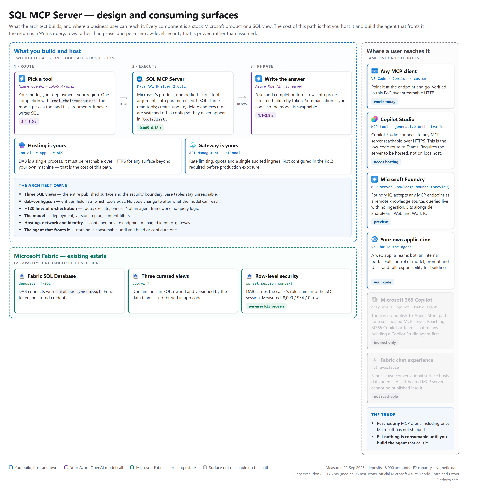

# SQL MCP Server over Microsoft Fabric — a starter kit

Stand up a governed, read-only MCP server over a SQL database, from nothing, in
about half an hour. Point it at the sample data first; point it at your own data
second.

Built on **[Microsoft Data API builder](https://learn.microsoft.com/azure/data-api-builder/)**,
which ships as the
**[SQL MCP Server](https://learn.microsoft.com/sql/mcp/)** — Microsoft's
first-party, open-source way to expose a SQL database to AI agents.

> **Start here for the product documentation:**
> **<https://learn.microsoft.com/sql/mcp/>**
> This repo is a worked example on top of it, not a replacement for it. When you
> hit something not covered here, that hub is the authority.

---

## What you get

A model can ask *"what is the total deposit balance for every branch?"* and get a
correct, complete answer — without ever writing SQL, and without being able to
reach anything you did not publish.

- **No bespoke query engine.** Data API builder is used unmodified.
- **Read-only by construction.** Create, update, delete and execute are absent
  from the tool list, not merely denied.
- **The views are the security boundary.** Base tables are never published.
- **Per-user row-level security**, proven by measurement, not assumed.
- **No stored credentials.** Microsoft Entra throughout, locally and in Azure.

---

## The architecture

What you build and host, what Fabric already gives you, and where a business
user can actually reach it.



Two things this diagram is trying to make unavoidable:

- **Nothing is consumable until you build the agent that fronts it.** The MCP
  server is an endpoint, not a chat experience. Stage two is one such agent;
  Copilot Studio and Foundry are others.
- **The greyed tiles are not oversights.** A self-hosted MCP server cannot be
  published into the Fabric chat experience, and it reaches Microsoft 365 Copilot
  only indirectly, via a Copilot Studio agent. That is a real constraint of this
  path and it is better known up front.

The timings on it were measured against the seed in this repo — 8,000 accounts on
an F2 capacity. Your numbers will differ; the shape should not.

---

## The three stages

Each stage is additive. Stop after any of them and nothing is missing or broken.

| Stage | You add | You get |
| --- | --- | --- |
| **1. The server** | A SQL database | A working MCP server, usable from VS Code, Copilot Studio or Microsoft Foundry |
| **2. The demo app** | An Azure OpenAI deployment | A web UI answering natural-language questions, with a live trace |
| **3. The comparison** | A published Fabric data agent | A side-by-side against Fabric's own data agent |

All three are in this repo. Stages two and three activate when you set their
environment variables — leave them unset and the features simply do not appear.

Note you can already ask natural-language questions after stage one, through VS
Code, Copilot Studio or Foundry. Those clients bring their own model. Stage two
is for when you want a self-contained page of your own, with a visible trace.

---

## Before you start

| Requirement | Notes |
| --- | --- |
| **A SQL database** | **Fabric SQL Database** is the path this repo is written for. Azure SQL, SQL Managed Instance and SQL Server all work identically. |
| **Python 3.10+** | For the seed and helper scripts. |
| **[ODBC Driver 18 for SQL Server](https://learn.microsoft.com/sql/connect/odbc/download-odbc-driver-for-sql-server)** | Required by `pyodbc`. Driver 17 will not do. |
| **[.NET 8+](https://dotnet.microsoft.com/download)** | Data API builder is a .NET tool. |
| **[Azure CLI](https://learn.microsoft.com/cli/azure/install-azure-cli)** | For `az login`. |

Install the Data API builder CLI once:

```bash
dotnet tool install -g Microsoft.DataApiBuilder
```

### Creating a Fabric SQL Database

If you do not have one: in [Fabric](https://app.fabric.microsoft.com), open a
workspace → **+ New item** → **SQL database**. It provisions in a minute or two.

Then **Settings → Connection strings** and copy two values:

```
Server    abcdefghijk-xxxxxxxxxx.database.fabric.microsoft.com
Database  deposits-aef098c2-f1e6-4bdd-b132-e8430f86b32f
```

> ⚠️ **The database name is not just the item name.** Fabric appends the item
> GUID. Putting `deposits` in `.env` will fail with `Cannot open database`.
> Copy the full value.

> **Why Fabric SQL Database rather than a Lakehouse?** It runs the Azure SQL
> engine, so it takes plain `CREATE TABLE` / `INSERT`, and row-level security via
> session context is **documented behaviour** rather than something you have to
> prove. A Lakehouse SQL analytics endpoint also works — see
> [`docs/08-other-databases.md`](docs/08-other-databases.md).

---

## Stage 1 — from nothing to a working server

### 1. Clone and install

```bash
git clone <this-repo>
cd fabric-sql-mcp-starter
pip install -r requirements.txt
```

### 2. Point it at your database

```bash
cp .env.example .env
```

Edit `.env`:

```ini
SQL_SERVER=abcdefghijk-xxxxxxxxxx.database.fabric.microsoft.com
SQL_DATABASE=deposits-aef098c2-f1e6-4bdd-b132-e8430f86b32f
```

No username or password. Authentication is Entra:

```bash
az login
```

### 3. Create the database from nothing

```bash
python scripts/setup.py
```

This runs four steps, each of which you can also run by hand:

| Step | File | What it does |
| --- | --- | --- |
| 1 | `sql/01-schema.sql` | Tables, indexes, 9 branches, 5 products |
| 2 | `scripts/seed.py` | ~8,000 synthetic accounts across 2,000 customers |
| 3 | `sql/02-views.sql` | The three published views |
| 4 | `sql/03-row-level-security.sql` | Fail-closed per-user security |

Everything is idempotent — re-run any step safely.

Want a different size? `python scripts/setup.py --accounts 50000`
The generator is deterministic, so the same `--seed` always produces the same
book.

### 4. Check it looks right

```bash
python scripts/verify.py
```

You should see ~8,000 accounts across 9 branches, and a balance-by-branch table.

### 5. Start the server

```bash
$env:MSSQL_CONNECTION_STRING = "Server=$env:SQL_SERVER,1433;Database=$env:SQL_DATABASE;Authentication=Active Directory Default;Encrypt=Yes;TrustServerCertificate=No;"
dab start -c dab/dab-config.json
```

```bash
# bash
export MSSQL_CONNECTION_STRING="Server=$SQL_SERVER,1433;Database=$SQL_DATABASE;Authentication=Active Directory Default;Encrypt=Yes;TrustServerCertificate=No;"
dab start -c dab/dab-config.json
```

It listens on `http://localhost:5000/mcp`.

### 6. Confirm what it advertises

```bash
python scripts/inspect_server.py
```

Expect **exactly three tools** — `describe_entities`, `read_records`,
`aggregate_records` — and three entities with full descriptions. If you see a
write tool, the config is wrong.

### 7. Use it from VS Code

`.vscode/mcp.json` is already wired. Open the folder, start the
`deposits` server, enable agent mode, and ask:

> What is the total deposit balance for every branch?

---

## Pointing it at your own data

Read **[`docs/02-configuring-dab.md`](docs/02-configuring-dab.md)** — a
line-by-line walkthrough of the config, including a worked example of publishing
a new entity from your own schema.

The short version:

1. **Write a view** that pre-joins what a question needs and omits anything
   sensitive. The view is your security boundary.
2. **Add an entity** pointing at it, with `key-fields` set.
3. **Describe every field properly.** This is the real work — the descriptions
   *are* the interface the model sees.
4. **Re-run `inspect_server.py`** to confirm the model sees what you intended.

---

## Deploying to Azure

**[`docs/04-deploy-to-azure.md`](docs/04-deploy-to-azure.md)** walks through
Azure Container Apps using managed identity — no connection secret at all.

> ### ⚠️ Read this before exposing anything publicly
>
> This repo ships with `"authentication": { "provider": "Unauthenticated" }`.
> That is correct on `localhost`. On a **public ingress it means anyone who finds
> the URL can read your database.**
>
> The deployment guide covers switching to Entra ID authentication with named
> roles. Do that step — it is not optional hardening, it is the difference
> between a demo and an incident.

---

## Row-level security

`sql/03-row-level-security.sql` gives each relationship manager their own book:

| Caller's role claim | Rows visible |
| --- | --- |
| `svc-all` | all of them |
| `B. Nakamura` | only that manager's customers |
| *(no claim)* | **zero** |

Fail-closed by design: a misconfiguration yields an empty result, never somebody
else's data.

```bash
python scripts/verify_rls.py
```

Toggle it with:

```bash
python scripts/rls.py --off     # see data in the demo app
python scripts/rls.py --on      # put the policy back
python scripts/rls.py           # report current state
```

> **The demo app will look empty until you do this.** `setup.py` applies the
> policy by default. It is claim-driven, so a local session — which presents no
> claim — correctly sees nothing. That is the design working, not a broken
> install. The app shows a banner saying so.

> **If you plan to try stage three**, note that a Fabric data agent cannot set
> session context, so with this policy enabled it sees zero rows — by design.
> You can demonstrate per-user security *or* the data agent comparison, not both
> at once.

---

## What is in here

```
sql/          schema, views, and the security policy
scripts/      setup, seed, verification, server inspection
dab/          dab-config.json - the file that decides what the model can reach
deploy/       Dockerfile and Azure Container Apps deployment
docs/         the guides
src/          database helper, and the two lanes used by the demo app
app.py        stage two - the demo web app
static/       the demo UI
```

## Stage two — the demo app

Once stage one works, add an Azure OpenAI deployment to `.env`:

```ini
AZURE_OPENAI_ENDPOINT=https://<your-resource>.cognitiveservices.azure.com
AZURE_OPENAI_DEPLOYMENT=gpt-4.1-mini
```

```bash
python app.py     # http://127.0.0.1:8000
```

It starts Data API builder for you, so you do not need a second terminal. The
trace panel shows which tool the model chose, the SQL that ran, the row count,
and where the time went.

Details: [`docs/06-stage-two-demo-app.md`](docs/06-stage-two-demo-app.md)

## Stage three — the comparison

Optional. Publish a Fabric data agent over the same data, then add:

```ini
FABRIC_WORKSPACE_ID=...
FABRIC_DATA_AGENT_ID=...
```

A **compare with data agent** toggle appears. Without these variables it stays
hidden and nothing else changes.

> A data agent cannot present a role claim, so with row-level security enabled
> it returns zero rows — by design. Run
> `sql/04-disable-row-level-security.sql` first, and re-run `03` afterwards.
> The app detects this and warns rather than showing an empty lane.

Details: [`docs/07-stage-three-comparison.md`](docs/07-stage-three-comparison.md)

## The guides

| Doc | What it covers |
| --- | --- |
| [**02 Configuring DAB**](docs/02-configuring-dab.md) | **The important one.** Line-by-line config, and how to publish your own schema |
| [03 Row-level security](docs/03-row-level-security.md) | How session context and the predicate fit together |
| [04 Deploy to Azure](docs/04-deploy-to-azure.md) | Container Apps, managed identity, Entra auth |
| [05 Troubleshooting](docs/05-troubleshooting.md) | The errors you are most likely to hit |
| [06 Stage two](docs/06-stage-two-demo-app.md) | The natural-language demo app |
| [07 Stage three](docs/07-stage-three-comparison.md) | Comparing against a Fabric data agent |
| [08 Other databases](docs/08-other-databases.md) | Azure SQL, SQL Server, Warehouse, Lakehouse |

---

## Microsoft documentation

- **[SQL MCP Server hub](https://learn.microsoft.com/sql/mcp/)** — start here
- [What is SQL MCP Server?](https://learn.microsoft.com/azure/data-api-builder/mcp/overview)
- [Data manipulation tools](https://learn.microsoft.com/azure/data-api-builder/mcp/data-manipulation-language-tools)
- [Add descriptions to entities](https://learn.microsoft.com/azure/data-api-builder/mcp/how-to-add-descriptions)
- [Quickstart: Azure Container Apps](https://learn.microsoft.com/azure/data-api-builder/mcp/quickstart-azure-container-apps)
- [Quickstart: VS Code](https://learn.microsoft.com/azure/data-api-builder/mcp/quickstart-visual-studio-code)
- [Quickstart: Microsoft Foundry](https://learn.microsoft.com/azure/data-api-builder/mcp/quickstart-azure-ai-foundry)
- [Data API builder configuration reference](https://learn.microsoft.com/azure/data-api-builder/configuration-file)
- [Model Context Protocol specification](https://modelcontextprotocol.io/specification/latest)

---

## About the sample data

Entirely synthetic, generated by `scripts/seed.py`. Customer names are assembled
from word lists. No real institution's data is involved.

A few deliberate quirks exist so the demo exercises real behaviour:

- Shanghai and Hong Kong Central hold **no USD**, so "USD by branch" returns
  **7** rows, not 9 — a model inventing the missing two is caught immediately.
- Only `CD` accounts have a maturity date.
- ~18% of customers roll up to a group parent, so group-exposure questions are
  meaningful.
